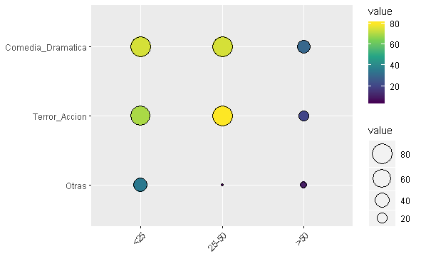
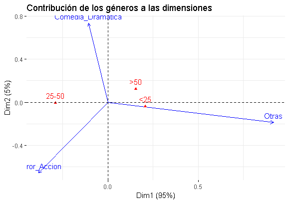
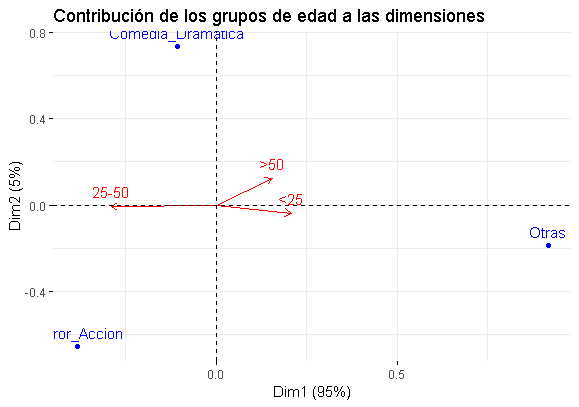

```{r setup, include=FALSE}
knitr::opts_chunk$set(echo = TRUE)
library(factoextra)
library(FactoMineR)
```

## Resumen Ejecutivo

El crecimento de las plataformas digitales se ha visto en auge ante la aparición del streaming como herramienta para la visualización de contenido. Para este caso se analizó una muestra de usuarios para los cuales se conoce su edad y el género de películas que consumen; con la finalidad de identicar si existe relación entre dichas variables. El principal resultado que se puedo concebir a través de la aplicación del análisis de componentes principales, se traduce en que las personas mayores a 50 años, albergan poco o nulo interés por consumir películas del género Terror-Acción. 

## Introducción

El presente informe buscó identificar la existencia de una relación entre la edad de los usuarios y el tipo de películas que consumen. En este sentido, se aplicará el análisis de correspondiencias para una muestra otorgada por una plataforma digital.

En inicio, el primer inconveniente en la información proporcionada fue que en determinados géneros y edades existen menos de 5 unidades muestrales por celda; este aspecto fue solventado al cruzar los géneros de las películas permitiendo otro tipo de análisis según un nuevo tipo de película (ver Tabla 1).

: Nueva tabla por género mezclado de películas y edades

|   Género-Edades   	| <25 	| 25-50 	| >50 	|
|:-----------------:	|:---:	|:-----:	|:---:	|
| Comédia Dramática 	|  75 	|   75  	|  30 	|
|  Terror - Acción  	|  70 	|   80  	|  20 	|
|       Otras       	|  35 	|   5   	|  10 	|


Avanzado en el proceso de exploración de los datos se empleó una visualización que relacionó los valores de cada género con los grupos de edad (Anexo A). En este nivel se observó una mayor relación entre la edad de 25 a 50 años con el género de Terror-Acción; mientras que, los menores a 25 años son más propensos a observar ambos géneros por igual. Además, se destacó que la categoría otras películas ostenta muy pocos valores comparada con el resto.

## Desarrollo

Al proseguir con el procesamiento de la información mediante la aplicación del análisis de correspondencias, se realizó el test de independencia. Al analizar el resultado se puede de establecer que las variables se encuentran relacionadas (rechazo de la prueba de independencia); por lo cual, podemos proseguir con el análisis respectivo.

En segunda instancia, al examinar los resultados del modelo se determina que la primera dimensión explica un 95.04% de la varianza; sin embargo, para poder realizar la correpondiente visualización y contrastación entre las variables se conserva la segunda dimensión.

\newpage

Al realizar un análisis por filas se destaca que el género otras películas, se encuentra correctamente representado por la primera dimensión, siendo su contribución para la misma en un 83.99%. Por su parte, las comedias-dramáticas y el género de terror-acción contribuyen a expllicar en gran manera la segunda dimensión.

En lo que corresponde al análisis por columnas, es evidente que la inercia es superior en el grupo de 25 a 50 años; simultáneamente, esta categoría contribuye en explicar en gran parte la primera dimensión. No obstante, la categoría que contribuye en la explicación de la segunda dimensión son las edades mayores a 50 años con un 78.70%.

Además, se empleó el gráfico de contribución por géneros, el cual destaca que la contibución de la categoría otras películas escencialmente en la primera dimensión; a su vez, la contribución de las comedias dramáticas fue mayor en la segunda dimensión (Anexo B).

Por su parte, al visualizar el gráfico de contribución por rangos de edad (Anexo C) se destacó que que la contibución de las edades entre 25 a 50 años fue superior en la primera dimensión; mientras, las dos categorías restantes evidenciaron una escasa contribución.

Finalmente, cabe destacar que en los gráficos de contribución se dificultó el relacionamiento entre las edades y los géneros de películas debido posiblemente al agrupamiento incial. Sin embargo, se puede extraer una conclusión dada la disposición contraria entre las personas mayores a 50 años y el género de Terror-Acción, indicando la nula preferencia de estas edades por este género.

## Conclusiones

- Para la información empleada el análisis de correspondencias, permite la reducción de las dimensiones a una sola (dicha dimensión explica el 95% de la varianza); destacandose la eficiencia de emplear este método.

- El análisis gráfico, permite realizar una abstracción en la cual es evidente que a lados opuestos del plano, se encuentran las edades superiores a 50 años y el género de Terror-Acción; lo que conlleva poco o nulo interés de las personas mayores por visualizar este género de películas.

- No obstante, la búsqueda del relacionamiento en dichas categorías no fue evidente (en el plano); aspecto que dificulta la segmentación por edad-género.

## Bibliografía y Recursos digitales

1. Notas técnicas. (octubre 2018). *Análisis de correspondencias*. Profesor: Juan Manuel López Zafra. CUNEF-Máster en Data Science para Finanzas.
2. R Program y RStudio Version 1.1.456 – © 2009-2018 RStudio, Inc.

## Anexos


\newpage




\newpage

---



\newpage




