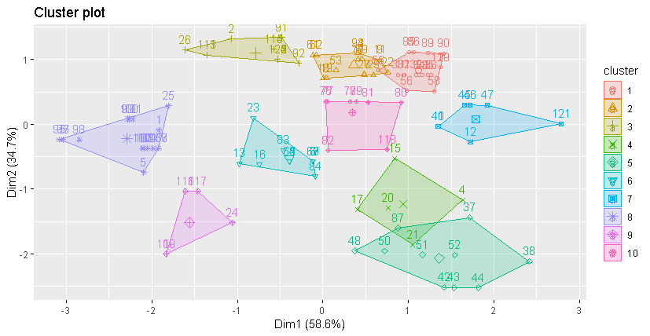

```{r setup, include=FALSE}
knitr::opts_chunk$set(echo = FALSE)
```

```{r, include=FALSE}
setwd("C:/Users/Edwin/Desktop/CUNEF/Master Data Science/Tecnicas de Agrupacion y reduccion de la dimension/2. Tecnicas de agrupacion/1. Analisis Cluster/Tarea Los coches del jefe")

# Install packages - Read SAV files (SPSS)
library(foreign)
# Load database
df <- read.spss('tterreno.sav', to.data.frame = TRUE)
head(df, 2)
str(df)
# Duplicate database
df1 <- df

# Identifify duplicate rows
df[duplicated(df$modelo) == TRUE,]
df$duplicates <- duplicated(df$modelo)
df <- df[df$duplicates == 'FALSE',]

# Combine brand and model
df$BrandModel <- paste(df$modelo)

# Use BrandModel as index
row.names(df) <- make.names(df$BrandModel, unique = T)

# Delete categorical variables
df <- df[, -c(1,2,15,16)]

# Transform seats and cylindres to numeric variable
FactorToNumeric <- function(factorvariable) {
  as_char <- as.character(factorvariable)
  as_num  <- as.numeric(as_char)
  return(as_num)
}
df['cilindro'] <- FactorToNumeric(df$cilindro)
df['plazas'] <- FactorToNumeric(df$plazas)
```

```{r, include=FALSE}
# Most important caracteristics for vehicle 4x4
# df <- df[c('pvp', 'cilindro', 'cc', 'potencia', 'rpm', 'peso')]
df <- df[c('potencia', 'rpm', 'peso')]
```

## Resumen Ejecutivo

El presente informe tiene por objetivo clasificar de forma homogénea a vehículos todo terreno (4x4) clásicos en diez grupos correspondiente a diez residencias. Para ello, se aplicó la técnica de clusterización "kmeans" empleando como variables relevantes al objeto de estudio: la potencia del vehículo, el peso y las revoluciones por minuto; con dicha información se agrupó cada clúster y cada residencias en base a su distancia; permitiendo alcanzar eficiencia en la distribución al procurar valores mínimos en las plazas sobrantes en cada ubicación.

## Introducción

Como preámbulo se tiene que el coleccionista ostenta 125 vehículos todo terreno (TT) y posee información relevante de cada uno de ellos. Además, se precisa el requerimiento de agrupar a los vehículos en 10 clusters, correspondiente al número de propiedades. Dado el requerimiento de establecer una determinada división de los vehículos, este trabajo busca emplear la forma más eficiente y consistente para dicha agrupación.


Para comenzar con este proceso fue preciso determinar una visión general del objeto de estudio. Donde se establece que la creación de dichos vehículos surgió en tiempo de guerra, ante la necesidad de acceder a terrenos de difícil acceso (zonas rurales, alta montaña, entre otros); posteriormente su uso se difundió a los civiles, sin embargo mantuvieron las características para las cuales fueron concebidos.

Entre los principales aspectos a destacar en los vehículos 4x4 se encuentran: tracción en las cuatro ruedas, fuerza de torque, motor potente, chasis con refuerzos; dadas estas facetas con base a la información recopilada de cada vehículo se procedió a seleccionar las variables relevantes para el análisis:

- El peso: relacionado a la durabilidad y resistencia de los vehículos todo terreno; además, se encuentra relacionado a la fortaleza de sus componentes. 
- La potencia: porque caracteriza la energía liberada por este tipo de vehículos que requieren de una mayor fuerza de torque para superar trayectos difíciles.
- Las revoluciones por minuto (rpm): su influencia radica en que a mayor número de vueltas en los pistones se incrementa la potencia del vehículo.

Mientras que no se tomaron en consideración las siguientes variables: el precio de venta al público (porque no se presenta como una característica de similiaridad), el número de asientos (por considerarse limitada en la segmentación de los todo terreno); el consumo de 90 km/h, el consumo de 120 km/h y el consumo urbano (debido a que la mayoría de los vehículos 4x4 albergan un alto consumo de combustible); el número de cilindros (porque su distribución es limitada a tres valores); los centímetros cúbicos (por su relación estrecha con la potencia y dicha variable ya se encuentra seleccionada); la velocidad máxima, la aceleración y el tiempo de aceleración (porque en estos vehículos se privilegia la potencia sobre la velocidad).

## Desarrollo

```{r, include=FALSE}
# Exploratory analysis
summary(df)

# Explore NA values
ExploreNA <- function(data) {
  TrueNA <- is.na.data.frame(data)
  SumNA <- colSums(TrueNA)
  PorcentNA <- colSums(TrueNA) / nrow(data)*100
  VariableNA <- data.frame(SumNA, PorcentNA)
  
  return(VariableNA)
} 
ExploreNA(df)

# Drop NA values form dataframe
df <- na.omit(df)
```

En un inicio, al examinar las variables relevantes se destaca que en los vehículos todo terreno la potencia media se encontró entre 117.5 caballos de vapor y las revoluciones por minuto oscilaron entre los 3600 y 6500. A su vez, el peso mínimo de los vehículos fue de 930 kilogramos y el máximo fue de 2320 kilogramos. Esta aproximación nos permite identificar que las variables se encuentran en diversas escalas, por lo cual se estandarizaron los datos para tener una homogeneidad en las medidas para realizar el método de agrupación. 

Al realizar un análisis de aquellas variables que presentaron valores NA, se tuvo como resultado que unicamente la variable del peso de los todo terreno presentó dos observaciones sin registros; por lo cual, se optó por omitir dichos vehículos de la segmentación. 

Es preciso destacar la existencia de 14 vehículos duplicados; ante ello, se procedió a no tomarlos en consideración en el análisis (manteniendo los vehículos no duplicados). Sin embargo, para su posterior inclusión se consolidarán en el mismo grupo correspondiente al modelo del vehículo que correspondan.

```{r, include=FALSE}
# Graphical exploratoy analysis
# BoxPlotNumCath <- function(data, categorical_x, numerical_y) {
#   library(ggplot2)
#   categorical <- as.factor(categorical_x)
#   ggplot(data = data, aes(x = categorical_x, y = numerical_y)) +
#     geom_boxplot() 
# }
# BoxPlotNumCath(df, df$cilindro, df$cc)

# ScatterPlotXY <- function(data, numerical_x, numerical_y) {
#   library(ggplot2)
#   ggplot(data = data, aes(x = numerical_x, y = numerical_y)) +
#     geom_point() +
#     geom_smooth(method = "lm", se = FALSE)
# 
# }
# ScatterPlotXY(df, df$rpm, df$potencia)

Histogram <- function(data, numerical) {
  library(ggplot2)
  ggplot(data = data, aes(x = numerical)) +
    geom_histogram() 
}
library(ggpubr)
ggarrange(Histogram(df, df$rpm), Histogram(df, df$peso), Histogram(df, df$potencia),
          labels = c("RPM", "Peso", "Potencia"),
          ncol = 1, nrow = 3, vjust = 0.8)
```

En esta primera instancia se empleó la función de agrupación "kmeans", mediante la cual se pudo establecer el análisis gráfico de la división por 10 grupos; además, se destacó el escaso solapamiento entre los grupos y la semejanza en las dimensiones de cada clúster (ver Figura 1).

En la Tabla 1, se denota que el Grupo 1 y 2 contienen una mayor cantidad de automóviles todo terreno; mientras que los Grupos 4, 7 y 9 mantuvieron una menor cantidad. No obstante, al comparar la relación entre el grupo con mayor cantidad de vehículos con referencia al de menor se establece una relacion de 3 a 1.


```{r, include=FALSE}
# Clusterization
library(factoextra)
# Scale variables
df <- scale(df)

# Euclidean clustering
# dfeuclidean <- eclust(x = df, FUNcluster = 'kmeans', stand = T, k = 10, 
#                       hc_metric = 'euclidean', seed = 7, nstart = 25)
dfeuclidean <- eclust(x = df, FUNcluster = 'kmeans', stand = T, k = 10, 
                      hc_metric = 'euclidean', seed = 7, nstart = 25)
# Detail clusterization groups
table(dfeuclidean$cluster)
```


---

```{r, include= FALSE}
# Work with data base (clustering by model)
df1 <- df1[c('marca','modelo','potencia', 'rpm', 'peso')]

# In kmeasn model we have cluster number of no duplicates car models
dfwithoutdup <- df1[duplicated(df1$modelo) == FALSE,]

# Fill complete information (out NA)
dfgroup <- data.frame(dfwithoutdup[-(6:7),], dfeuclidean$cluster)

# Find duplicates car models
dfwithdup <- df1[duplicated(df1$modelo) == TRUE,]
dfwithdup$dfeuclidean.cluster <- c(3, NA, 6, 5, 2, 1, 1, 1, 2, 2, 2, 5, 8 ,3)

# Merge df of duplicates with df of clustering
dfgroup <- rbind(dfgroup, dfwithdup)

# Find missing observations (7, 8) y duplicate (10)
  # dfmissing <- df1[which(is.na(df1$peso)),]
df1$dfeuclidean.cluster <- NA
dfgroup <- rbind(dfgroup, df1[7:8,])

dfgroup$index <- as.numeric(row.names(dfgroup))
dfgroup <- dfgroup[order(dfgroup$index), ]
colnames(dfgroup)[6] <- 'cluster'

# Detail clusterization groups with NA and duplicates
table(dfgroup$cluster)

```


Posterior a la aplicación del método *kmeas* para la clasificación de los automóviles todo terreno, se procede a incluir los coches duplicados en cada uno de los clúster que corresponda; para ello, se identificó el modelo del 4x4 y agrupó en la categoría correspondiente (ver Tabla 1). Cabe destacar que para el modelo se emplearon 109 observaciones, al incluir los duplicados a la clasificación aumentó el número a 122; no obstante tres observaciones con valores perdidos quedaron pendientes de ser clasificadas.

: Tabla de agrupación de los vehículos 4x4 (kmeans)

| Clúster - Agrupación | Modelo sin  duplicados | Modelo con duplicados |
|:--------------------:|:----------------------:|:---------------------:|
|        Grupo 1       |           17           |           20          |
|        Grupo 2       |           16           |           20          |
|        Grupo 3       |           12           |           14          |
|        Grupo 4       |            5           |           5           |
|        Grupo 5       |           10           |           12          |
|        Grupo 6       |           12           |           13          |
|        Grupo 7       |            7           |           7           |
|        Grupo 8       |           16           |           7           |
|        Grupo 9       |            5           |           5           |
|       Grupo 10       |            9           |           9           |
|         Total        |           109          |          122          |


Ante el requerimiento de dividir la colección en diversos grupos es preciso tomar en consideración las siguientes directrices: los vehículos se deben distribuir entre las 10 propiedades existentes, cada residencia puede alojar máximo 15 automóviles y el criterio de distribución debe ser conforme a un criterio de distancia.

En primera instancia, en base a la visualización procedente del modelo de clasificación se realizó un conglomerado de los grupos (grupos macro) que contengan a los grupos del modelo; siendo el criterio de agrupación la cercanía entre grupos en el plano (ver Figura 1). 

En este sentido, se obtuvo la siguiente clasificación de grupos macro y sus respectivos subgrupos según su cercanía:

- Grupo Macro 1: Grupo 1 y Grupo 2
- Grupo Macro 2: Grupo 4, Grupo 5 y Grupo 10
- Grupo Macro 3: Grupo 6 y Grupo 8
- Grupo Macro 4: Grupo 3
- Grupo Macro 5: Grupo 7
- Grupo Macro 6: Grupo 9



\newpage

Simultánemente, se realizó el mismo procedimiento en las residencias mediante la agrupación por cercanía territorial (ver Figura 2):

- Territorio 1: Casa 3, Casa 5 y Casa 10
- Territorio 2: Casa 1 y Casa 2
- Territorio 3: Casa 6 y Casa 7
- Territorio 4: Casa 4
- Territorio 5: Casa 9
- Territorio 6: Casa 8


A partir de las distinciones propuestas y relacionando los criterios de disntancias cercanas entre grupos y a nivel territorial se determina la siguiente distribución de los vehículos 4x4: 

1) En Sanremo (casa 10) se ubican 15 vehículos (grupo 2), en Vence (casa 3) se disponen 5 vehículos (grupo 2) y 10 vehículos (grupo 1) y en Saint-Raphaël (casa 5) se colocan 10 vehículos (grupo 1).

2) En la residencia de Le Perreux-sur-Marne (casa 1) se disponen 5 vehículos (grupo 4) y 10 vehículos (grupo 5); además en Bougival (casa 2) se disponen 2 vehículos (grupo 5) y 9 vehículos (grupo 10).

3) En Colombier (casa 6) se ubican 15 vehículos (grupo 8) y en Montenol (casa 7) se colocan 2 vehículos (grupo 8) y 13 vehículos (grupo 6).

4) En la residencia de Palasca (casa 4) se disponen 14 vehículos (grupo 3).

5) En la residencia de Mérens-les-Vals (casa 9) se disponen 7 vehículos (grupo 7).

6) En la residencia de Yves (casa 8) se disponen 9 vehículos (grupo 9).


\newpage


Para un entendimento de la distribución y las plazas restantes se dispuso la Tabla 2, que plasma la relación entre los grupos y las residencias.


: Relación de Grupos Macro y Conglomerados Terriorio

|     Agrupación  clúster    |  Conglomerado territorio | Nª plazas restantes |
|:--------------------------:|:------------------------:|:-------------------:|
|  Grupo Macro 1 (40 coches) | Territorio 1 (45 plazas) |          5          |
|  Grupo Macro 2 (26 coches) | Territorio 2 (30 plazas) |          4          |
|  Grupo Macro 3 (30 coches) | Territorio 3 (30 plazas) |          0          |
|  Grupo Macro 4 (14 coches) | Territorio 4 (15 plazas) |          1          |
|  Grupo Macro 5 (7 coches)  | Territorio 5 (15 plazas) |          8          |
|  Grupo Macro 6 (5 coches)  | Territorio 6 (15 plazas) |          10         |

Por útimo se establce que las observaciones que ostentaban valores faltantes y no pudieron ser clasificadas, se las consideró dentro del Grupo 9 (grupo con menor número de vehículos) y se ubicaron en la residencia de Yves (casa 8), dejando solamente 7 plazas restantes.


```{r, include= FALSE}
library(dplyr)
grupos <- dfgroup %>% 
  dplyr::group_by(cluster)

estatgrupos <- grupos %>% dplyr::summarise(
  n = n(),
  potencia = round(mean(potencia), 0),
  rpm = mean(rpm),
  peso = mean(peso)
)

estatgrupos %>% dplyr::arrange(desc(potencia))
```


## Conclusiones

- Para la agrupación de las observaciones se consideraron como variables fundamentales: la potencia del automotor, el peso y las revoluciones por minuto; debiendose su consideración a las caractéristicas primordiales y uso de este tipo de vehículos todo terreno.
- La técnica de agrupación "kmeans" otorgó una adecuada aproximación para la segmentación de los vehículos en las 10 categorías requeridas. Este proceso permitió una distribución consensuada de los automotóres en base al criterio de distancia por grupos y la distancia territorial.
- Se destaca que la agrupación fue eficiente al dejar pocas plazas vacias en las residencias.

## Bibliografía y Recursos digitales

1. Notas técnicas. (octubre 2018). *El análisis cluster*. Profesor: Juan Manuel López Zafra. CUNEF-Máster en Data Science para Finanzas.
2. R Program y RStudio Version 1.1.456 – © 2009-2018 RStudio, Inc.

## Anexos

**Anexo A: Listado de vehículo por marca, modelo y su respectiva agrupación**

```{r, include=TRUE}
# Detalles clasificación por modelo
dfgroup[, c(1,2,6)]
```