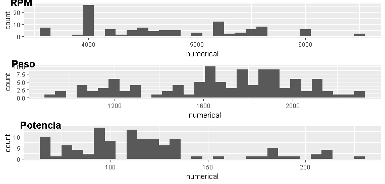
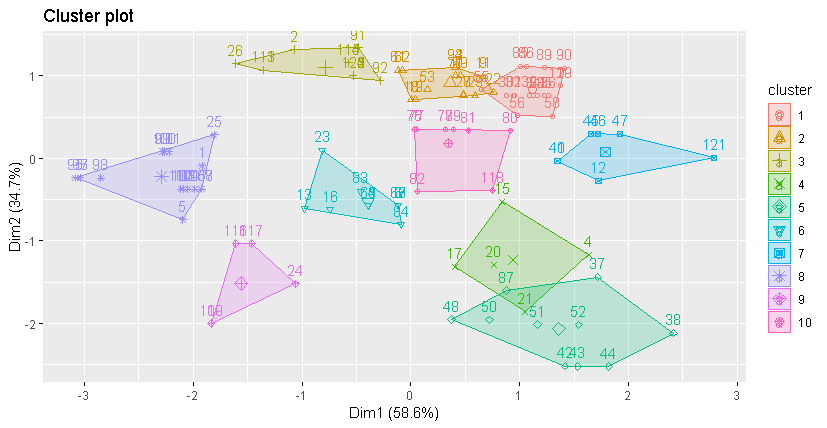
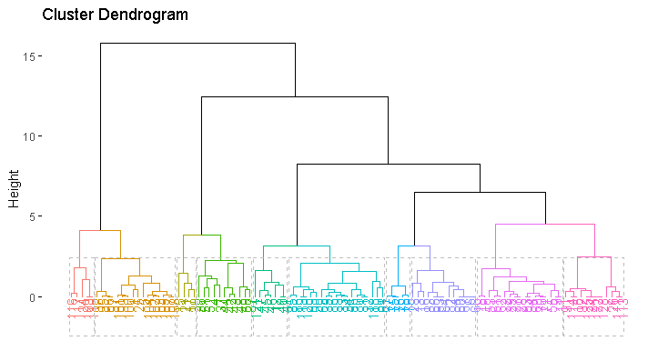

```{r setup, include=FALSE}
knitr::opts_chunk$set(echo = FALSE)
```

```{r, include=FALSE}
setwd("C:/Users/Edwin/Desktop/CUNEF/Master Data Science/Tecnicas de Agrupacion y reduccion de la dimension/2. Tecnicas de agrupacion/1. Analisis Cluster/Tarea Los coches del jefe")

# Install packages - Read SAV files (SPSS)
library(foreign)
# Load database
df <- read.spss('tterreno.sav', to.data.frame = TRUE)
head(df, 2)
str(df)

# Identifify duplicate rows
df[duplicated(df$modelo) == TRUE,]
df$duplicates <- duplicated(df$modelo)
df <- df[df$duplicates == 'FALSE',]

# Combine brand and model
df$BrandModel <- paste(df$modelo)

# Use BrandModel as index
row.names(df) <- make.names(df$BrandModel, unique = T)

# Delete categorical variables
df <- df[, -c(1,2,15,16)]

# Transform seats and cylindres to numeric variable
FactorToNumeric <- function(factorvariable) {
  as_char <- as.character(factorvariable)
  as_num  <- as.numeric(as_char)
  return(as_num)
}
df['cilindro'] <- FactorToNumeric(df$cilindro)
df['plazas'] <- FactorToNumeric(df$plazas)
```

```{r, include=FALSE}
# Most important caracteristics for vehicle 4x4
# df <- df[c('pvp', 'cilindro', 'cc', 'potencia', 'rpm', 'peso')]
df <- df[c('potencia', 'rpm', 'peso')]
```

## Resumen Ejecutivo

El presente informe tiene por objetivo clasificar de forma homogénea a vehículos todo terreno clásicos en diez grupos. Para ello, se emplearon como variables relevantes al objeto de estudio: la potencia del vehículo, el peso y las revoluciones por minuto; con dicha información se aplicó la técnica de clusterización "kmeans" y "jerárquica", teniendo como resultado la conformación de grupos por cada modelo que ostenta el coleccionista (Anexo A).

## Introducción

El presente informe alberga como objetivo la agrupación de los vehículos clásicos todo terreno (4x4), en base a características relevantes que fundamenten la segmentación. Dado el requerimiento de establecer una determinada división de los vehículos, este trabajo busca emplear la forma más eficiente y consistente para dicha agrupación.

Como preámbulo se tiene que el coleccionista ostenta 125 vehículos todo terreno (TT) y posee información relevante de cada uno de ellos. Además, se precisa el requerimiento de agrupar a los vehículos en 10 clusters, correspondiente al número de propiedades.

Para comenzar con este proceso fue preciso determinar una visión general del objeto de estudio. Donde se establece que la creación de los vehículos TT surgió en tiempo de guerra, ante la necesidad de acceder a terrenos de difícil acceso (zonas rurales, alta montaña, entre otros); posteriormente su uso se difundió a los civiles, sin embargo mantuvieron las características para las cuales fueron concebidos.

Entre los principales aspectos a destacar en los vehículos 4x4 se encuentran: tracción en las cuatro ruedas, fuerza de torque, motor potente, chasis con refuerzos; dadas estas facetas con base a la información recopilada de cada vehículo se procedió a seleccionar las variables relevantes para el análisis:

- El peso: relacionado a la durabilidad y resistencia de los vehículos todo terreno; además, se encuentra relacionado a la fortaleza de sus componentes. 
- La potencia: porque caracteriza la energía liberada por este tipo de vehículos que requieren de una mayor fuerza de torque para superar trayectos difíciles.
- Las revoluciones por minuto (rpm): su influencia radica en que a mayor número de vueltas en los pistones se incrementa la potencia del vehículo.

Mientras que no se tomaron en consideración las siguientes variables: el precio de venta al público (porque no se presenta como una característica de similiaridad), el número de asientos (por considerarse limitada en la segmentación de los todo terreno); el consumo de 90 km/h, el consumo de 120 km/h y el consumo urbano (debido a que la mayoría de los vehículos 4x4 albergan un alto consumo de combustible); el número de cilindros (porque su distribución es limitada a tres valores); los centímetros cúbicos (por su relación estrecha con la potencia y dicha variable ya se encuentra seleccionada); la velocidad máxima, la aceleración y el tiempo de aceleración (porque en estos vehículos se privilegia la potencia sobre la velocidad).

## Desarrollo

```{r, include=FALSE}
# Exploratory analysis
summary(df)

# Explore NA values
ExploreNA <- function(data) {
  TrueNA <- is.na.data.frame(data)
  SumNA <- colSums(TrueNA)
  PorcentNA <- colSums(TrueNA) / nrow(data)*100
  VariableNA <- data.frame(SumNA, PorcentNA)
  
  return(VariableNA)
} 
ExploreNA(df)

# Drop NA values form dataframe
df <- na.omit(df)
```

En un inicio, al examinar las variables relevantes se destaca que en los vehículos todo terreno la potencia media se encontró entre 117.5 caballos de vapor y las revoluciones por minuto oscilaron entre los 3600 y 6500. A su vez, el peso mínimo de los vehículos fue de 930 kilogramos y el máximo fue de 2320 kilogramos. Esta aproximación nos permite identificar que las variables se encuentran en diversas escalas, por lo cual se estandarizaron los datos para tener una homogeneidad en las medidas para realizar el método de agrupación. 

Al realizar un análisis de aquellas variables que presentaron valores NA, se tuvo como resultado que unicamente la variable del peso de los todo terreno presentó dos observaciones sin registros; por lo cual, se optó por omitir dichos vehículos de la segmentación. 

Es preciso destacar la existencia de 14 vehículos duplicados; ante ello, se procedió a no tomarlos en consideración en el análisis (manteniendo los vehículos no duplicados). Sin embargo, para su posterior inclusión se consolidarán en el mismo grupo correspondiente al modelo del vehículo que correspondan.

```{r, include=FALSE}
# Graphical exploratoy analysis
# BoxPlotNumCath <- function(data, categorical_x, numerical_y) {
#   library(ggplot2)
#   categorical <- as.factor(categorical_x)
#   ggplot(data = data, aes(x = categorical_x, y = numerical_y)) +
#     geom_boxplot() 
# }
# BoxPlotNumCath(df, df$cilindro, df$cc)

# ScatterPlotXY <- function(data, numerical_x, numerical_y) {
#   library(ggplot2)
#   ggplot(data = data, aes(x = numerical_x, y = numerical_y)) +
#     geom_point() +
#     geom_smooth(method = "lm", se = FALSE)
# 
# }
# ScatterPlotXY(df, df$rpm, df$potencia)

Histogram <- function(data, numerical) {
  library(ggplot2)
  ggplot(data = data, aes(x = numerical)) +
    geom_histogram() 
}
library(ggpubr)
ggarrange(Histogram(df, df$rpm), Histogram(df, df$peso), Histogram(df, df$potencia),
          labels = c("RPM", "Peso", "Potencia"),
          ncol = 1, nrow = 3, vjust = 0.8)
```

En lo que conlleva el análisis exploratorio de manera gráfica, se visualizaron las tres variables: revoluciones por minuto (rpm), peso del vehículo y la potencia mediante histogramas. Se destacó la homogenidad en la distribución del peso de los todo terreno, la concentración de la potencia en menores caballos de vapor y la amplitud en la distribución de las revolucion por minuto, especialmente concentrada en las 4000 rpm.



A continuación, se procedió a realizar la agrupación de los vehículos 4x4 mediante dos técnicas, la primera se enfoca en la determinación de centroides y la segunda se realiza por medio de la agrupación jerárquica.

En esta primera instancia se empleó la función "kmeans", mediante la cual se pudo establecer el análisis gráfico de la división por 10 grupos, donde fue evidente la diferenciación de cada agrupación; además, se destacó el escaso solapamiento entre los grupos y la semejanza en las dimensiones de cada clúster.

En la Tabla 1, se denota que el Grupo 1, 2 y 8 contienen una mayor cantidad de automóviles todo terreno; mientras que los Grupos 4, 7 y 9 mantuvieron una menor cantidad. No obstante, al comparar la relación entre el grupo con mayor cantidad de vehículos con referencia al de menor se establece una relacion de 3 a 1.

Con la finalidad de comprobar la robustez de la agrupación realizada, se procedió a realizar el modelo mediante la agrupación jerárquica. Al comparar los resultados, no se presentan grandes diferencias en las dimensiones de cada grupo comparados con los resultados de la técnica anterior.

Al analizar la Tabla 2, cabe destacar dos aspectos importantes que nos se presentaron en la primera agrupación. Se destaca que el grupo con menor cantidad de vehículos todo terreno fue el Grupo 7 (cuatro vehículos); mientras que el grupo con mayor cantidad de automotores fue el Grupo 9 con un total de 19 vehículos 4x4.

\newpage

```{r, include=FALSE}
# Clusterization
library(factoextra)
# Scale variables
df <- scale(df)

# Euclidean clustering
# dfeuclidean <- eclust(x = df, FUNcluster = 'kmeans', stand = T, k = 10, 
#                       hc_metric = 'euclidean', seed = 7, nstart = 25)
dfeuclidean <- eclust(x = df, FUNcluster = 'kmeans', stand = T, k = 10, 
                      hc_metric = 'euclidean', seed = 7, nstart = 25)
# Detail clusterization groups
table(dfeuclidean$cluster)
```



: Tabla de agrupación de los vehículos 4x4 (kmeans)

| Clúster - Agrupación | Vehículos |
|:--------------------:|:---------:|
|        Grupo 1       |     17    |
|        Grupo 2       |     16    |
|        Grupo 3       |     12    |
|        Grupo 4       |     5     |
|        Grupo 5       |     10    |
|        Grupo 6       |     12    |
|        Grupo 7       |     7     |
|        Grupo 8       |     16    |
|        Grupo 9       |     5     |
|       Grupo 10       |     9     |

```{r, include=FALSE}
# Hierarchical Clustering
dfhierarchical <- eclust(x = df, FUNcluster = 'hclust', k = 10, stand = T, 
                         seed = 7, nstart = 25)
# Detail clusterization groups
table(dfhierarchical$cluster)
# Dendogram 10 groups
fviz_dend(dfhierarchical, rect = TRUE)
```




: Tabla de agrupación de los vehículos 4x4 (jerarquía)

| Clúster - Agrupación | Vehículos |
|:--------------------:|:---------:|
|        Grupo 1       |     16    |
|        Grupo 2       |     12    |
|        Grupo 3       |     11    |
|        Grupo 4       |     13    |
|        Grupo 5       |     17    |
|        Grupo 6       |     7     |
|        Grupo 7       |     4     |
|        Grupo 8       |     5     |
|        Grupo 9       |     19    |
|       Grupo 10       |     5     |

\newpage

## Conclusiones

- Para la agrupación de las observaciones se consideraron como variables fundamentales: la potencia del automotor, el peso y las revoluciones por minuto; debiendose su consideración a las caractéristicas primordiales y uso de este tipo de vehículos todo terreno.
- La técnica de agrupación "kmeans" y "jerárquica" otorgan una adecuada aproximación para la segmentación de los vehículos; donde se comprobó la robustez de los resultados al comparar ambas metodologías.
- Dado que el objetivo del trabajo radicó en la determinación de 10 grupos que agruparan a los vehículos 4x4 se formuló el Anexo A. 

## Bibliografía y Recursos digitales

1. Notas técnicas. (octubre 2018). *El análisis cluster*. Profesor: Juan Manuel López Zafra. CUNEF-Máster en Data Science para Finanzas.
2. R Program y RStudio Version 1.1.456 – © 2009-2018 RStudio, Inc.

## Anexos

**Anexo A: Listado de vehículo por modelo y su respectiva agrupación**

```{r, include=TRUE}
# Detalles clasificación por modelo
data.frame(Grupo = dfeuclidean$cluster)
```